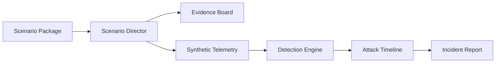

# AdverSim Architecture

AdverSim starts as a JSON-first full-stack defense lab:

- **Frontend:** Next.js, TypeScript, Tailwind, Recharts
- **Backend:** Python FastAPI
- **Data:** Package-driven synthetic scenario catalog with in-memory session state
- **Reports:** Markdown output

## Safe Simulation Boundary

AdverSim only models adversary behavior as synthetic logs. It does not run commands against systems, perform live targeting, collect credentials, generate malware, or provide evasion workflows.

## Scenario Package Flow

Each package provides mission briefings, key threat logs, background noise, expected findings, response guidance, and prevention lessons. The Scenario Director samples from the package, injects noise according to difficulty, and publishes one synchronized case to the dashboard, telemetry, detections, timeline, and reports.

## Backend Endpoints

- `GET /health`
- `GET /api/scenarios`
- `POST /api/simulations/run`
- `GET /api/simulations/latest`
- `GET /api/telemetry`
- `GET /api/detections`
- `GET /api/timeline`
- `GET /api/reports/latest`

## Next Data Step

Move scenario packages into JSON seed files, then migrate completed investigations and case history to SQLite when the data model stabilizes.
