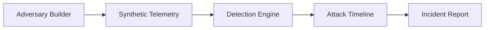

# AdverSim Architecture

AdverSim starts as a JSON-first full-stack defense lab:

- **Frontend:** Next.js, TypeScript, Tailwind, Recharts
- **Backend:** Python FastAPI
- **Data:** In-memory placeholder state seeded from synthetic scenario logic
- **Reports:** Markdown output

## Safe Simulation Boundary

AdverSim only models adversary behavior as synthetic logs. It does not run commands against systems, perform live targeting, collect credentials, generate malware, or provide evasion workflows.

## Initial Vertical Slice

## Backend Endpoints

- `GET /health`
- `GET /api/scenarios`
- `POST /api/simulations/run`
- `GET /api/simulations/latest`
- `GET /api/telemetry`
- `GET /api/detections`
- `GET /api/timeline`
- `GET /api/reports/latest`

## Next Data Step

Move the scenario metadata and generated simulation runs into JSON seed files, then migrate to SQLite when the data model stabilizes.
